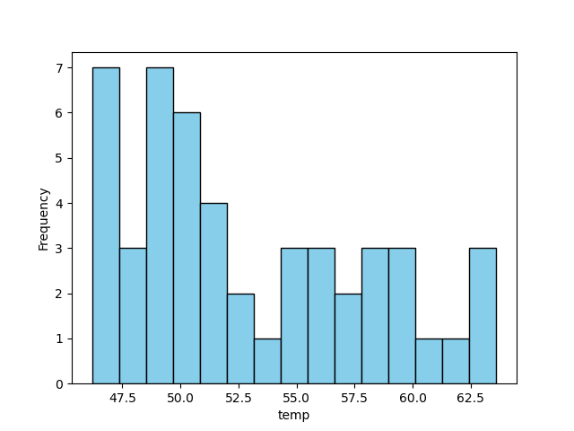
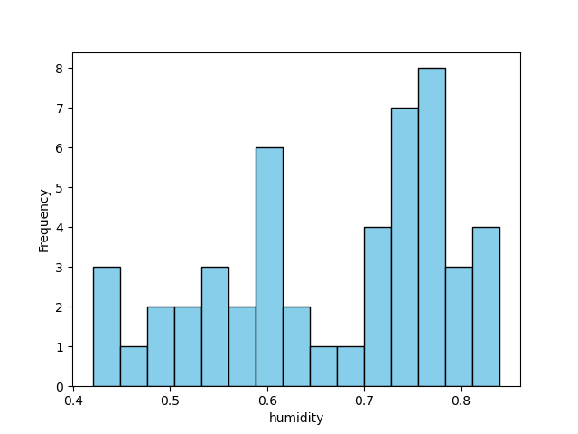
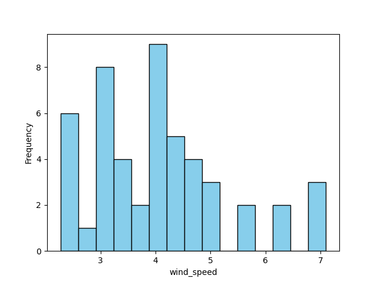
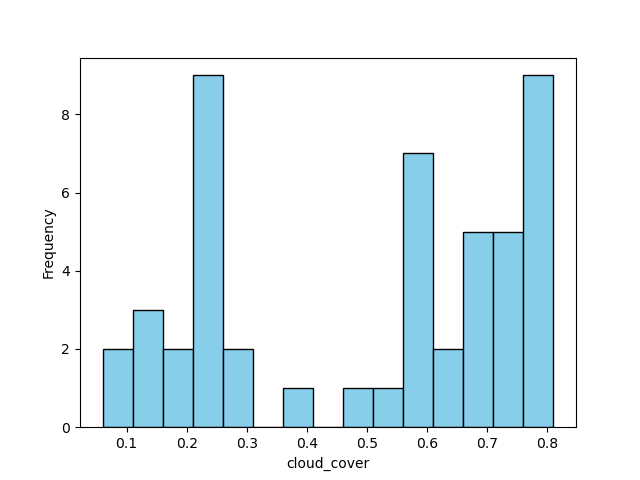
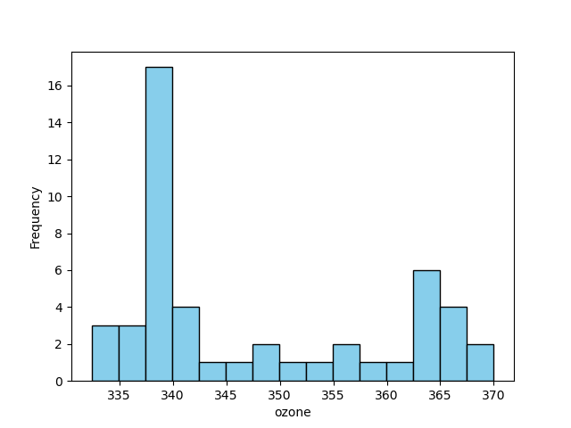
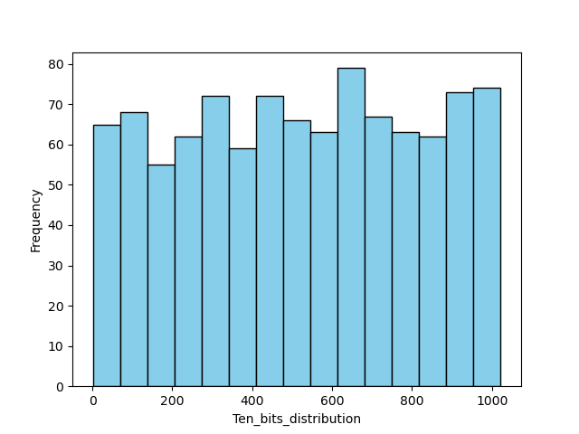
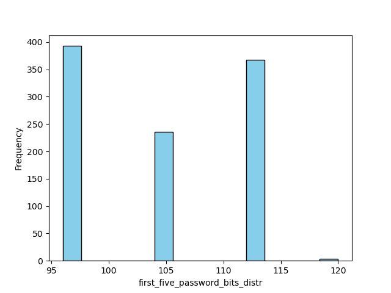
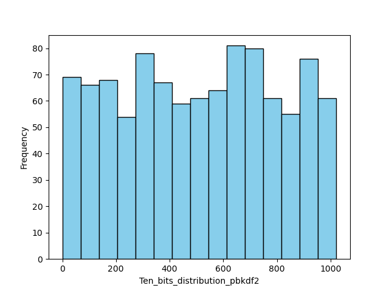

# lab 4

## Распределение данных
### Temperature

### Humidity 

### Wind speed

### Cloud cover

### Ozone

## распределение 10 бит выходных ключей
В качестве ключевого материала была взята температура.

Температура -- случайная величина, распределение которой далеко от равномерного.

Распределение данной случайной величины представлено на графике:

### Temperature

Если непосредственно температуру использовать как ключ, то некоторые байты будут встречаться чаще остальных, что может повлиять на криптостойкость вашей системы.

Для генерации ключей изначальным значением выбирается сумма всех температур в строковом представлении.

Например, вы передали температуры [55.1, 52.3], тогда изначальное значение получится

`"55.152.3"`

### Почему выбран именно такой механизм аггрегации? 

Наш отдел провел исследование и понял, что строковое представление числа с плавающей точкой -- биективная функция, поэтому такое значение будет также случайно, как и данные о переданной температуре.

### А зачем данные аггрегировать? 

Защита от брутфорсa

### Полученное распределение первых десяти байт 1000 ключей, полученных на основе информации о температуре

## PBKDF2
### Распределение первых пяти битов паролей

### Распределение 10 бит выходных ключей

