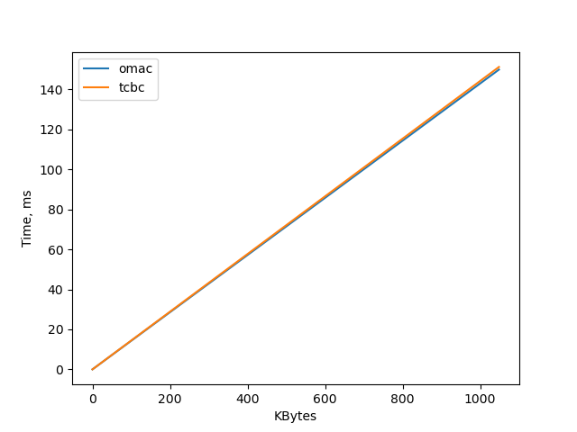
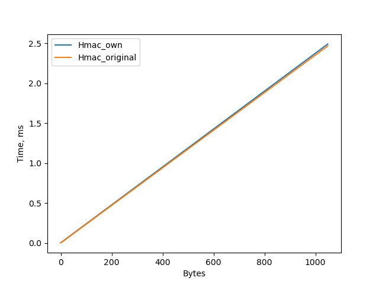

# lab3 
То что на графике кажется, что hmac выполняется за 0 секунд ~-- это обман!

## Старые значения до оптимизаций
hmac = [6851.8, 7975.9, 28699.9, 2490953.6]   
omac = [11765.1, 328447.1, 3319941.2, 340070585.8] 
tcbc = [9601.1, 328081.4, 3307998.8, 337991691.0] 

## Новые 
hmac = [6567.3, 7874.7, 28818.1, 2508768.9]  
omac = [7331.8, 148659.8, 1445388.8, 148095578.9]  
tcbc = [9133.1, 145896.6, 1446024.9, 147032941.1]  

ORIGINAL_hmac = [4062.6, 3781.1, 24893.7, 2462047.4]  

## Omac Tcbc
  

## Hmac 
На графике также решил сравнить скорость реализации со стандартной. (Но опять ничего не видно из-з) 
  
